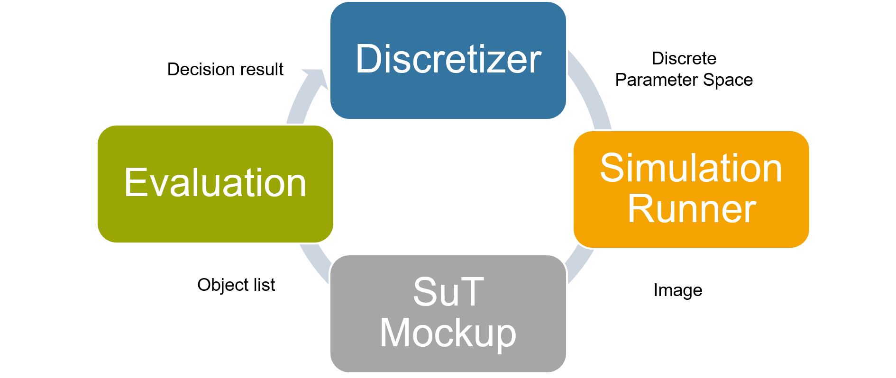
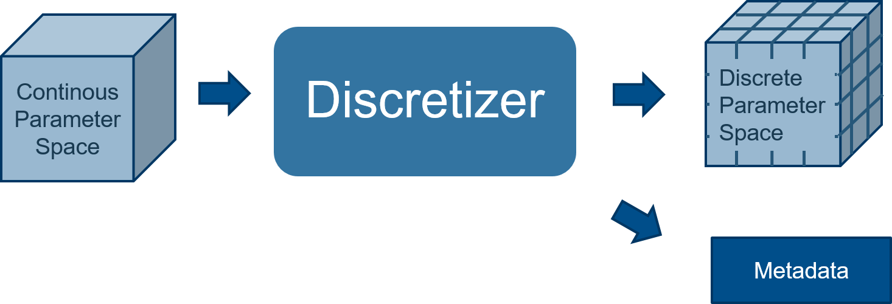
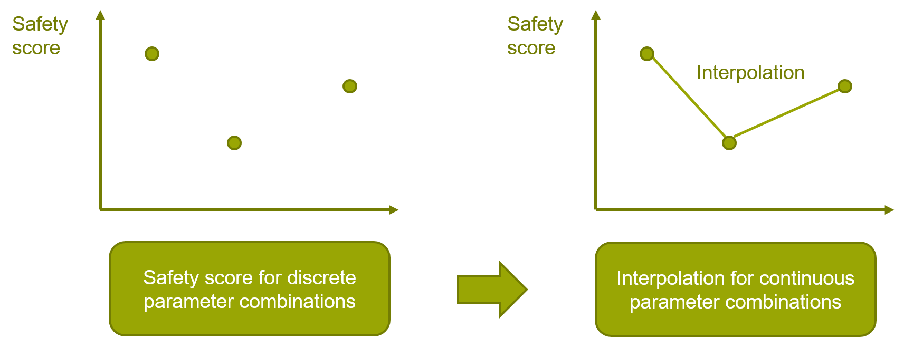
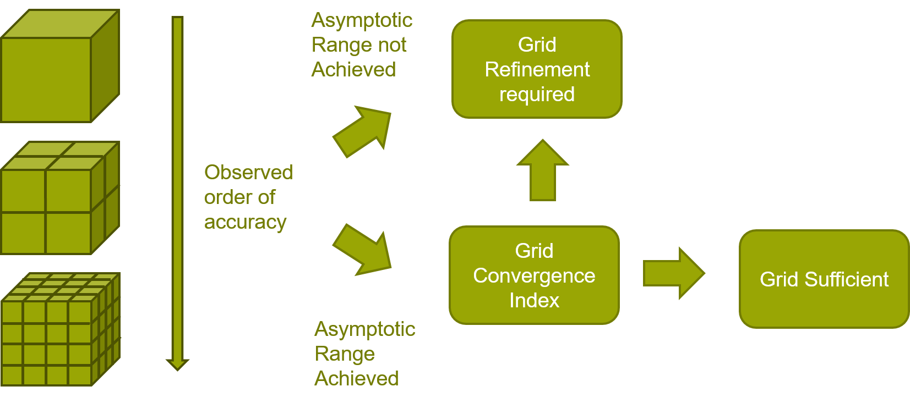

# Parameter Discretization

The main purpose of this project is to verify whether interpolation is feasible for the safety score of different scenarios.

## Table of Contents

  - [Install](#install)
  - [Terminology](#terminology)
    - [Parameter combination](#parameter-combination)
    - [Parameter space](#parameter-space)
  - [Introduction](#introduction)
    - [Discretizer](#discretizer)
    - [Runner](#runner)
      - [Scenario](#scenario)
      - [Simulation Orchestration and Execution](#simulation-orchestration-and-execution)
      - [Results and Saving](#results-and-saving)
    - [SuT Mockup](#sut-mockup)
    - [Evaluation](#evaluation)
      - [Safety score](#safety-score)
      - [Interpolation](#interpolation)
      - [Grid Evaluation](#grid-evaluation)
      - [Asymptotic Range](#asymptotic-range)
      - [Grid criterion](#grid-criterion)
  - [Setup Carmaker](#setup-carmaker)
  - [Modules](#modules)
    - [IOHandlers](#iohandlers)
    - [Discretizers](#discretizers)
    - [Runners](#runners)
    - [PngHandlers](#pnghandlers)
    - [ScoreCalculators](#scorecalculators)
    - [Evaluaters](#evaluaters)
  - [Metadata](#metadata)
    - ['instance.toml'](#instancetoml)
    - ['instances.toml'](#instancestoml)
    - ['grid.toml'](#gridtoml)


## Install

This project uses basically common packages, so we don't list them here. Third-party software packages(e.g. YOLOv5, cmerg) should be installed according to their respective requirements.

> Tip: If you encounter some errors with thrid-party 'cmerg', please try changing your computer system language to English.

## Terminology 

The following terminology is used in this file.

### Parameter combination

The set of parameters required to unambiguously define one concrete scenario.
Each parameter has exactly one concrete value.

### Parameter space

The set of all parameter combinations.
The parameter space can either be continous or discrete.
The continous parameter space contains all possible or plausible parameter combinations.

The discrete parameter space contains a subset of the continous parameter space obtained by introducing a discrete step for each parameter.
The discrete parameter space will also be referred to as grid.

## Introduction

The following figure shows the initial idea of the project. 
Some of functions are not yet completed, but it shows the motivation and the workflow of this project very well. 



### Discretizer

The discretizer receives the continous parameter space as input and generates a discrete parameter space.

It should be able to do the following things:
- Refine an existing discrete parameter space with a constant factor
- iterative refinement based on grid evaluation
- Create a discrete parameter space from scratch which may be viewed as starting with the edges of the parameter space and refining from there
- (r-adaptation of an existing discrete parameter space)

The data format of the discrete parameter space is specified.
It includes the discrete parameter space and metadata regarding the grid refinement. 
The metadata includes the corresponding two previous coarser grids and the refinement factor. 
The parameter space is saved in the specified data format.



### Runner

Takes the discrete parameter space specifying a set of concrete scenarios and outputs simulation results.
The results are saved.

#### Scenario

The scenario will be an already implemented simple scenario.
Initially, it is assumed that a simple static scenario is sufficient.
Only few or even one parameter are varied in the beginning. 
This is later expanded to dynamic and more complex scenarios.

#### Simulation Orchestration and Execution

For simplicity, it is decoupled from the SuT and the rest of the evalution procedure.
CarMaker is used for the simulation environment. 
The input are a discrete parameter space and a scenario (testrun file in CarMaker).

Orchestration takes the discrete parameter space and extracts the parameter combinations. 
Each parameter combination is combined with testrun file to extract new testrun file for CarMaker.
Results for a given parameter combination are loaded from previously computed data if existent.

Otherwise, execution means running a concrete scenario for the given parameter combination in CarMaker. 

CarMaker offers options for combining orchestration and execution, which are investigated. 
If necessary, utility scripts are written to perform customized orchestration and trigger the execution in CarMaker.

#### Results and Saving

The results are output as image files in jpg or png format which can be ingested by any object detector. 
IPG movie may directly allow outputting these, otherwise utility scripts are needed to output and sort files in a suitable format. 

The saved results are associated with a parameter combination. 
Previously computed results are accessible and can be retrieved with the parameter combination instead of recomputing.

### SuT Mockup

The system under test mockup receives scenario execution outputs to generate SuT output. 
It includes the full complexity of a deep neural network in order to be representative.
For simplicity the SuT Mock-up is fully decoupled from the simulation execution.

The SuT mockup is realized as a perception system with a deep neural network.
The output is an object list consisting of 2D or 3D bounding boxes.
An off-the-shelf pre-trained detector is sufficient. 
Cars and people are detected since they are highly relevant for traffic.
The detection performance is sufficiently high to yield some results which can be used for evaluation.

### Evaluation

The evaluation consists of a safety score for the SuT mockup, interpolating over the whole continous parameter space and evaluating the grid.

#### Safety score

An evaluation metric which evaluates the object list with regard to safety is constructed.
The metric generates a single score for one concrete scenario.

Common perception metrics do not fulfil this function, making it necessary to construct a custom function.
The metric correlates positively with safety and considers existence, classification, confidence and localization error.

#### Interpolation

The safety score is only known for the discrete parameter space.
Interpolation is used to construct the safety score for a more fine-grain grid or even the continous parameter space.
The interpolation is a substitute for orchestration, execution, SuT Mockup and the safety score.
It allows to directly generate a safety score for an arbitrary parameter combination or discrete parameter space. 

The interpolation is realized as simple piecewise linear interpolation between the known points of the grid.



#### Grid Evaluation

The grid is evaluated to assure the interpolation approximates the safety of the SuT sufficiently well for the continous parameter space. 
The result is a decision if the grid is sufficiently fine-grained.

#### Asymptotic Range 

Asymptotic range is required for a reliable grid evaluation.
The interpolation results only reliable within the asymtotic range.
Asymptotic range is achieved if the theoretical and observed order of accuracy match.

- The theoretical order of accuracy is second order accuracy if piecewise linear interpolation between results is used.
- The observed order for the finest grid is calculated from results on three grids.
[p = ln\[(f_3-f_2)/(f_2-f_1)\]/ln(r)]
For confirmation this order is calculated twice using four grids overall.

This module requires the discrete parameter space including the metadata regarding the grid refinement.
Additionally, the corresponding interpolation results for each grid are required.
It outputs if asymptotic range is achieved for a single grid. 

If asymptotic range is not achieved the grid is too coarse.

#### Grid criterion

Roache's Grid Converge Index is applied to estimate accuracy. 
GCI = F_s/(r^p-1) * | (f_h-f_rh)/f_h | 

The input are two solutions for the finer grid, one using the fine grid, the other using the coarse grid and interpolation. 
Asymptotic range for both grids is checked. 

If the GCI is above a decision threshold the grid is too coarse. 



## Setup Carmaker

Before we go through the code, we want to introduce the CarMaker setup at first.
Our project use two kinds of simulation results from CarMaker. 
One is the ERG file, which will be parsed by third party 'cmerg' and provide GT for us.
The other one is the png file from IPGmovie, which will be parsed by third party 'YOLOv5'.
The simulation can only proceed smoothly when you first create the carmaker's folder and place the testrun file in appropriate directory(e.g. "C:\CM_folder\Data\TestRun\xxx").
Go check the User Guide of CarMaker, if you want to know more details.

## Modules

This chapter introduces the code of the program and the dataflow. 

### IOHandlers

This module comes entirely from [Parametervariation](https://git.rwth-aachen.de/fzd/vvm/parametervariation), go check it if you need.

This module can parse, read and write the testrun file of CarMaker and parameter file('.param').
We have made some small changes to fix the bugs. 
You can find them according to the comments in the program.

Currently the parameter discretization is only available for 1D. 
Hence the parameter file should also be 1D, in other words, just one line.

**xxx.param**
```toml
'Traffic.0.Init.Road[0]' = '10, 200'
```

```toml
'Env.VisRangeInFog' = '10, 10000'
```

### Discretizers

Discretizier receives the parameter space(1D) and testrun file from IOHandlers.
Starting with the edges of the parameter space, the parameter will be refined.
Meanwhile, metadata will be created in toml format. 
The introduction of metadata will be presented in the next chapter

Currently Discretizier is based on 'np.linespace'. 
['np.meshgrid'](https://numpy.org/doc/stable/reference/generated/numpy.meshgrid.html) is recommended if you want to expand to multi-dimensional.

### Runners

This module is an extension of [Parametervariation](https://git.rwth-aachen.de/fzd/vvm/parametervariation).
Some new functions are added for IPGmovie.
After this module, GT and Png_paths are stored in the metadata.

> Tip: Sometimes the program can be interrupted due to VPN disconnection. 
> You can find which Parameter combination the system was simulating in the error message. 
> The metadata of this combination will be corrupted due to system interruption. In this case you need to create the corresponding metadata by copying and modifying one of the other metadata. 
> Then continue to run the 'Runner'

> Tip: GT is given in a global coordinate system. 
> But the names of these three coordinates are not constant, you can find the specific names in the UAQ of CarMaker.

### PngHandlers

In this module, YOLOV5 is used to analyze the pictures from CarMaker. 
To ensure that objects are always detected, the confidence threshold is set very low.
The results of this module are object lists with confidence.

### ScoreCalculators

In this module, object lists and GT are compared to calcute Safety Score.
GT is given in a global coordinate system. 
Therefore lens parameters are needed for coordinate transformation.
Lens parameters are accessible in the carmaker folder.

> Tip: This module is currently only available for cameras that do not rotate in the X, Y, Z axis, i.e., only capture the back of the car.

### Evaluaters

Safety Score are further processed in this module.
The results(e.g. P, GCI) are stored in the metadata.

## Metadata

There are three types of metadata 'grid', 'instances' and 'instance'.

### 'instance.toml'

'instance.toml' and parameter combination correspond to each other.
All results of each combination during the simulation are stored in this metadata , including GT, png_paths.

### 'instances.toml'

'instacnes.toml' store the paths of all 'instance.toml'. 
Before each parameter combination is simulated, the 'Runner' queries 'instance.toml' path of this combination by accessing 'instances.toml'.
If the result already exists in 'instance.toml', this simulation will be skipped.

### 'grid.toml'

'grid.toml' and gird correspond to each other.
'grid.toml' store the paths of all 'instance.toml' in this grid.


